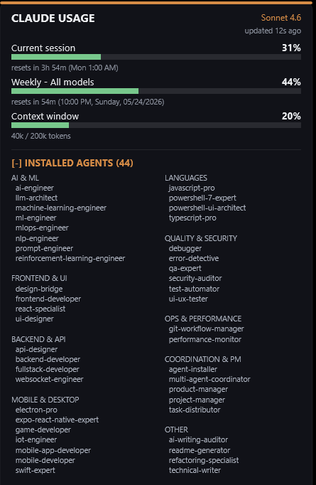

# Claude Usage

Desktop widgets that display live Claude Code usage statistics. All data is read from a
local file written by your Claude Code statusline script. There are no remote API calls.

| Platform | Status | Technology |
|---|---|---|
| [Windows](windows/) | Available | Rainmeter skin |
| [macOS](mac/) | Coming soon | — |

---

## Windows — Rainmeter Skin

A Rainmeter desktop widget for Windows 10/11.

| Expanded | Collapsed |
|---|---|
|  |  |

### Features

- **Session limit (5-hour rolling window)** — token usage bar, percent, and live countdown
  to the next reset, showing the exact wall-clock time (e.g. "11:00 PM" or "Tue 4:30 PM").
- **Weekly all-models limit (7-day)** — token usage bar, percent, and full reset timestamp
  (e.g. "9:00 PM, Sunday, 05/25/2026").
- **Context window** — tokens used vs. total (formatted, e.g. "45.2k / 200k") with a
  color-coded bar.
- **Active model name** — shown in the header (e.g. "Sonnet 4.6").
- **Data freshness** — "updated N minutes ago" label driven by the UPDATED epoch key.
- **Collapsible agents list** — a category-grouped, two-column list of your installed Claude
  Code agents. Click the header chevron to expand or collapse.
- **Color-coded progress bars** — green below 50 %, amber 50–79 %, red at 80 % and above.

### Requirements

| Requirement | Notes |
|---|---|
| Windows 10/11 | Rainmeter is Windows-only. |
| [Rainmeter](https://www.rainmeter.net/) 4.5 or later | Free, open-source desktop customization tool. |
| [Claude Code](https://docs.anthropic.com/claude-code) | CLI tool that generates the usage data. |
| PowerShell 5.1+ | Required to run `statusline.ps1`. Ships with Windows 10/11. |
| Segoe UI font | Included with Windows; no installation needed. |

### Installation

#### Option A — .rmskin package (recommended)

1. Download the latest `ClaudeUsage-<version>.rmskin` from the
   [Releases](../../releases) page.
2. Double-click the `.rmskin` file. Rainmeter's installer opens automatically.
3. Click **Install** and the skin appears in the Rainmeter Manager.

#### Option B — run the installer (from a cloned repo)

Double-click **`windows/install.bat`**. It detects your Rainmeter skins folder, copies the
skin in, and loads it automatically, with no manual steps in the Rainmeter Manager. If
[Rainmeter](https://www.rainmeter.net/) isn't installed, the installer offers to open the
download page for you.

Equivalent from a terminal:

```powershell
powershell -ExecutionPolicy Bypass -File windows/install.ps1
```

#### Option C — build the .rmskin yourself

```powershell
# From the repo root
powershell -ExecutionPolicy Bypass -File windows/build-rmskin.ps1
# Produces windows/ClaudeUsage-3.0.rmskin — double-click to install.
```

#### Option D — manual copy

Copy `ClaudeUsage.ini` and `@Resources/` into a `ClaudeUsage` folder inside your Rainmeter
skins directory:

```
C:\Users\<YourName>\Documents\Rainmeter\Skins\ClaudeUsage\
```

Then open the Rainmeter Manager and load `ClaudeUsage.ini`.

### Configure statusline.ps1

Claude Code calls `~/.claude/statusline.ps1` on every statusline render. The script must
write a flat UTF-8 `key=value` file to:

```
C:\Users\<YourName>\Documents\Rainmeter\Skins\ClaudeUsage\@Resources\usage.txt
```

### Data file format

`@Resources/usage.txt` — one `KEY=VALUE` pair per line, written by `statusline.ps1`.

| Key | Type | Description |
|---|---|---|
| `UPDATED` | Unix epoch | Timestamp of the last write. |
| `MODEL` | String | Active model name, e.g. `Sonnet 4.6`. |
| `CTX_PCT` | Number 0–100 | Context window usage percentage. |
| `CTX_IN` | Integer | Tokens used in the current context window. |
| `CTX_SIZE` | Integer | Total context window size in tokens. |
| `FIVEH_PCT` | Number 0–100 | Five-hour rolling limit usage percentage. |
| `FIVEH_RESET` | Unix epoch | When the five-hour limit resets. |
| `SEVEND_PCT` | Number 0–100 | Seven-day all-models limit usage percentage. |
| `SEVEND_RESET` | Unix epoch | When the seven-day limit resets. |

### Agents section

The collapsible agents panel reads `@Resources/agents.txt` — one `CATEGORY|agent-name`
entry per line. See [`windows/install-agents.sh`](windows/install-agents.sh) (requires Bash — Git Bash,
WSL, or macOS/Linux) for an interactive installer that populates this file from the
[VoltAgent/awesome-claude-code-subagents](https://github.com/VoltAgent/awesome-claude-code-subagents)
repository.

### Troubleshooting

**Widget shows "no data"** — verify `statusline.ps1` is writing to the correct path and
Claude Code is running an active session.

**Countdowns show "--"** — `FIVEH_RESET` or `SEVEND_RESET` are missing or not valid
Unix epoch integers.

**Agents panel is empty** — `agents.txt` doesn't exist or has no valid `CATEGORY|name`
lines. Run `install-agents.sh` or create the file manually.

---

## Version

3.0

## Author

[Eric Chan](https://github.com/EricChan277)

## License

MIT. See [LICENSE](LICENSE).
