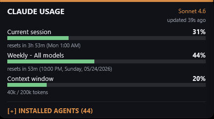

# Claude Usage: Rainmeter Skin

A Rainmeter desktop widget for Windows that displays live Claude Code usage statistics
on your desktop. All data is read from a local file written by your Claude Code
statusline script. The skin itself makes no remote API calls.

---

| Expanded | Collapsed |
|---|---|
|  |  |

---

## Features

- **Session limit (5-hour rolling window)** — token usage bar, percent, and live countdown
  to the next reset, showing the exact wall-clock time (e.g. "11:00 PM" or "Tue 4:30 PM").
- **Weekly all-models limit (7-day)** — token usage bar, percent, and full reset timestamp
  (e.g. "9:00 PM, Sunday, 05/25/2026").
- **Context window** — tokens used vs. total (formatted, e.g. "45.2k / 200k") with a
  color-coded bar.
- **Active model name** — shown in the header (e.g. "Sonnet 4.6").
- **Data freshness** — "updated N minutes ago" label driven by the UPDATED epoch key.
- **Collapsible agents list** — a category-grouped, two-column list of your installed Claude
  Code agents. Click the header chevron to expand or collapse. Category headers are bold and
  orange; agent names are indented. The section persists its open/closed state across reloads.
- **Color-coded progress bars** — green below 50 %, amber 50–79 %, red at 80 % and above.

---

## Requirements

| Requirement | Notes |
|---|---|
| Windows | The skin uses Rainmeter, which is Windows-only. |
| [Rainmeter](https://www.rainmeter.net/) 4.5 or later | Free, open-source desktop customization tool. |
| [Claude Code](https://docs.anthropic.com/claude-code) | CLI tool that generates the usage data. |
| PowerShell 5.1+ | Required to run `statusline.ps1`. Ships with Windows 10/11. |
| Segoe UI font | Included with Windows; no installation needed. |

---

## How it works

Claude Code exposes a hook called a statusline script. Every time it renders its terminal
statusline, it calls `~/.claude/statusline.ps1`. That script writes a flat `key=value` file
to `@Resources/usage.txt` inside the skin folder. The Rainmeter skin reads that file every
second via a Lua script, computes countdowns from the stored Unix epoch timestamps, and
renders the meters.

```
Claude Code (running) --> statusline.ps1 --> @Resources/usage.txt --> Rainmeter skin
```

No network requests are made at the Rainmeter layer.

---

## Installation

### 1. Install Rainmeter

Download and install Rainmeter from <https://www.rainmeter.net/>. The default install
directory is `C:\Users\<YourName>\Documents\Rainmeter\Skins\`.

### 2. Place the skin

Copy the `ClaudeUsage` folder into your Rainmeter skins directory:

```
C:\Users\<YourName>\Documents\Rainmeter\Skins\ClaudeUsage\
```

The folder must contain:

```
ClaudeUsage\
  ClaudeUsage.ini
  @Resources\
    usage.lua
    usage.txt          (created automatically by statusline.ps1)
    agents.txt         (optional; see Agents section below)
  install-agents.sh    (optional agent installer)
  README.md
```

### 3. Configure statusline.ps1

Claude Code calls `~/.claude/statusline.ps1` on every statusline render. Create or edit
that file so it writes the required keys to `usage.txt`.

The script must write a UTF-8 `key=value` file to the path:

```
C:\Users\<YourName>\Documents\Rainmeter\Skins\ClaudeUsage\@Resources\usage.txt
```

The skin reads this path from the `DataFile` variable defined in `ClaudeUsage.ini`:

```ini
[Variables]
DataFile=#@#usage.txt
```

`#@#` expands to the skin's `@Resources\` directory at runtime.

### 4. Load the skin in Rainmeter

Open the Rainmeter Manager (right-click the system tray icon > Manage), navigate to
`ClaudeUsage`, and double-click `ClaudeUsage.ini` to load it. The widget will appear
on your desktop.

---

## Data file format

`@Resources/usage.txt` is a plain UTF-8 text file with one `KEY=VALUE` pair per line.
It is written by `statusline.ps1` and read by the skin's Lua script every second.

| Key | Type | Description |
|---|---|---|
| `UPDATED` | Unix epoch (integer) | Timestamp of the last write; used to compute the "updated N ago" label. |
| `MODEL` | String | Display name of the active model, e.g. `Sonnet 4.6`. |
| `SESSION` | String | Human-readable session token count (informational). |
| `COST` | String | Session cost string (informational). |
| `CTX_PCT` | Number (0–100) | Context window usage percentage. |
| `CTX_IN` | Integer | Tokens used in the current context window. |
| `CTX_SIZE` | Integer | Total size of the context window in tokens. |
| `FIVEH_PCT` | Number (0–100) | Five-hour rolling limit usage percentage. |
| `FIVEH_RESET` | Unix epoch (integer) | When the five-hour limit resets. |
| `SEVEND_PCT` | Number (0–100) | Seven-day all-models limit usage percentage. |
| `SEVEND_RESET` | Unix epoch (integer) | When the seven-day limit resets. |
| `TODAY_TOKENS` | Integer | Tokens used today (informational). |

Example file:

```
UPDATED=1748127600
MODEL=Sonnet 4.6
SESSION=32,400
COST=$0.12
CTX_PCT=23
CTX_IN=46080
CTX_SIZE=200000
FIVEH_PCT=41
FIVEH_RESET=1748131200
SEVEND_PCT=67
SEVEND_RESET=1748649600
TODAY_TOKENS=128000
```

---

## Agents section

The collapsible agents panel reads `@Resources/agents.txt`. Each line describes one
installed agent in the format:

```
CATEGORY|agent-name
```

Example:

```
development|code-reviewer
development|refactor-assistant
writing|documentation-writer
testing|test-generator
```

The Lua script groups agents by category, preserving the order they appear in the file,
and splits the grouped list into two balanced columns. Category headers are rendered in
uppercase, bold, and orange. Agent names are indented beneath their category.

If `agents.txt` is absent or empty, the agents panel header still appears but the body
is blank. The panel can still be expanded and collapsed.

### Populating agents.txt manually

Write one `CATEGORY|agent-name` entry per line. The category name is arbitrary text;
it will be uppercased in the display. Blank lines and lines without a `|` separator
are ignored.

### Using install-agents.sh

`install-agents.sh` is an interactive Bash script that installs and uninstalls Claude Code
agents from the [VoltAgent/awesome-claude-code-subagents](https://github.com/VoltAgent/awesome-claude-code-subagents)
repository and keeps `agents.txt` in sync.

**Requirements:** Bash shell (Git Bash, WSL, or macOS/Linux terminal). Remote mode
additionally requires `curl`.

**Run it:**

```bash
bash install-agents.sh
```

**What it does on first run:**

1. Prompts you to choose a source:
   - **Local** — reads from a locally cloned copy of the agents repository (faster,
     works offline). Only available if the `categories/` directory exists next to the script.
   - **Remote** — fetches category and agent lists from the GitHub API and downloads
     agent `.md` files on demand.
2. Prompts you to choose an install target:
   - **Global** — installs agents to `~/.claude/agents/` (available in all projects).
   - **Local** — installs agents to `.claude/agents/` in the current working directory
     (project-scoped).
3. Presents a category browser. Select a category to see its agents.
4. For each agent list, you can:
   - Toggle individual agents on or off.
   - Select all agents in the category.
   - Deselect all agents in the category.
   - The list shows which agents are already installed.
5. Confirms and applies installs/uninstalls, then updates `agents.txt`.

---

## Skin variables reference

These variables are declared in `[Variables]` inside `ClaudeUsage.ini` and can be
overridden via the Rainmeter skin settings or `!SetVariable` bangs.

| Variable | Default | Description |
|---|---|---|
| `PanelW` | `440` | Total widget width in pixels. |
| `BarW` | `408` | Progress bar width in pixels. |
| `AgentsOpen` | `1` | `1` = agents panel expanded; `0` = collapsed. Persisted to the ini file on toggle. |
| `ExpandH` | `696` | Widget height when agents panel is open. |
| `CollapseH` | `242` | Widget height when agents panel is collapsed. |
| `FontName` | `Segoe UI` | Font used for all meters. |
| `cText` | `235,237,240,255` | Primary text color (RGBA). |
| `cDim` | `140,146,158,255` | Secondary/dimmed text color. |
| `cAccent` | `214,140,70,255` | Orange accent color used for the top bar, model name, and category headers. |
| `cTrack` | `255,255,255,26` | Progress bar track (unfilled) color. |

---

## Troubleshooting

**The widget shows "no data".**
The skin has not found a valid `usage.txt`. Verify that `statusline.ps1` is configured
and that Claude Code is running an active session. Check the exact path written by the
script matches the `DataFile` variable in `ClaudeUsage.ini`.

**Countdowns show "--".**
The `FIVEH_RESET` or `SEVEND_RESET` keys are missing or not valid integers. Confirm
that `statusline.ps1` writes Unix epoch values (seconds since 1970-01-01 UTC) for
those keys.

**The agents panel is empty.**
Either `agents.txt` does not exist or contains no valid `CATEGORY|name` lines. Run
`install-agents.sh` or create the file manually.

**install-agents.sh: "GitHub API rate limit exceeded".**
The unauthenticated GitHub API allows 60 requests per hour per IP. Wait and retry, or
clone the agents repository locally and use local source mode.

---

## Version

3.0

## Author

[EricChan277](https://github.com/EricChan277)

## License

MIT. See [LICENSE](LICENSE).
